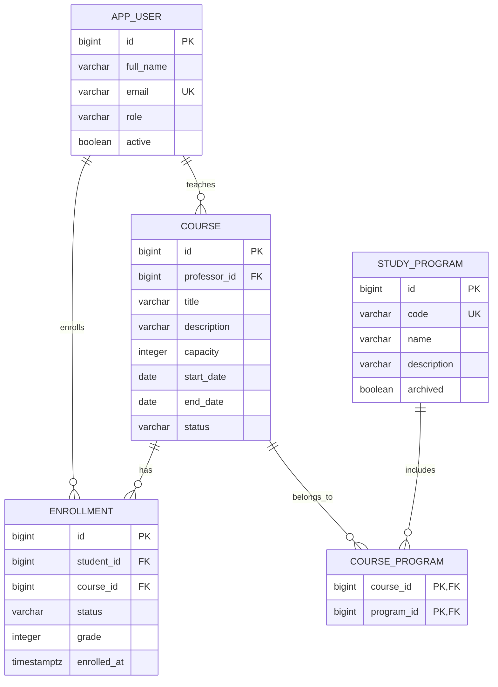

# Система записи на университетские элективные курсы

Лабораторная работа №1 по высоконагруженным системам: REST-монолит на Java и Spring Boot.
Студенты записываются на курсы с ограниченной вместимостью, преподаватели управляют обучением,
администратор организует каталог образовательных программ.

## Стек

| Компонент | Версия / решение |
|---|---|
| Java | 25 LTS, без preview-возможностей |
| Сборка | Maven 3.9.11, Maven Wrapper |
| Spring Boot | 4.1.1 |
| Доступ к данным | Spring Data JPA, Hibernate |
| База данных | PostgreSQL 17.9 |
| Миграции | Flyway, версии зависимостей управляются Spring Boot |
| Документация | OpenAPI 3.0, springdoc 3.1.1, общий Swagger UI |
| Тестирование | JUnit Jupiter, Mockito, MockMvc, Testcontainers 1.21.4 |
| Покрытие | JaCoCo 0.8.14, обязательный минимум 70% строк всего приложения |

Версии зафиксированы в `pom.xml` и Docker-образах. Микросервисы, авторизация, брокеры и файлы
относятся к следующим лабораторным и здесь не реализованы.

## Запуск через Docker Compose

Нужен запущенный Docker с Linux-контейнерами. Для этого способа Java и Maven на хосте не требуются.

```bash
docker compose up -d --build --wait
```

Compose соберёт приложение в Maven-контейнере, выполнит модульные тесты, запустит PostgreSQL,
дождётся готовности БД и приложения. Flyway создаст структуру автоматически.
Интеграционные тесты запускаются отдельной командой `verify`, поскольку требуют Docker API.

- Swagger UI: <http://localhost:8080/swagger-ui/index.html>
- Общая спецификация: <http://localhost:8080/v3/api-docs>
- Проверка готовности: <http://localhost:8080/actuator/health>

```bash
docker compose ps
docker compose logs app
docker compose down
```

`down` сохраняет данные в именованном томе. Не используйте `down -v`, если они нужны.
Имя Compose-проекта задано явно, поэтому запуск поддерживает путь с кириллицей.

В репозитории нет обязательных тестовых данных. Чтобы заполнить приложение демонстрационным сценарием:

```powershell
powershell -ExecutionPolicy Bypass -File scripts/demo.ps1
```

Скрипт создаёт преподавателя, студента, программу и курс; связывает их, оформляет запись и отменяет курс.
После отмены проверяет состояние записи. Повторные запуски создают отдельные демонстрационные данные.

## Конфигурация

Без `.env` используются значения для локальной разработки. При необходимости скопируйте `.env.example` в `.env`.

| Переменная | Назначение | Значение по умолчанию |
|---|---|---|
| `POSTGRES_DB` | БД в Compose | `course_management` |
| `POSTGRES_USER` | Пользователь БД в Compose | `course_app` |
| `POSTGRES_PASSWORD` | Пароль БД в Compose | `local_dev_password` |
| `DB_PORT` | Порт PostgreSQL на хосте | `5432` |
| `APP_PORT` | Внешний порт приложения в Compose / порт JVM при локальном запуске | `8080` |
| `DB_URL` | JDBC URL при запуске JVM | `jdbc:postgresql://localhost:5432/course_management` |
| `DB_USERNAME` | Пользователь БД при запуске JVM | `course_app` |
| `DB_PASSWORD` | Пароль БД при запуске JVM | `local_dev_password` |
| `DB_POOL_SIZE` | Максимальное число соединений | `10` |

При Compose JDBC URL, имя и пароль передаются приложению через `environment` из `POSTGRES_*`.
Внутренний порт приложения в контейнере всегда 8080; внешний можно изменить.

Для разработки на хосте нужны JDK 25 и Docker:

```powershell
docker compose up -d db
.\mvnw.cmd spring-boot:run
```

На Linux/macOS используйте `./mvnw`. Spring Boot сам не читает `.env`:
если параметры БД менялись, передайте соответствующие `DB_*` переменные локальному процессу.

## Модель и границы системы

Один `Course` — один запуск курса, например «Java Backend, осень 2026».
Каждый курс ведёт один преподаватель. Курс может входить в несколько программ,
но его вместимость общая. Программы организуют каталог: принадлежность студента к программе
не ограничивает запись. Учет расписания, заданий и оплаты отсутствует.



- **One-to-Many / Many-to-One:** `Course.enrollments` ↔ `Enrollment.course`; преподаватель ↔ курсы.
- **Many-to-Many:** `Course.programs` через `course_program`, без каскадного удаления программ.
- **Many-to-Many с дополнительными полями:** студенты ↔ курсы через отдельную Entity `Enrollment`.
- `UNIQUE(student_id, course_id)` защищает от дублей. После отказа восстанавливается та же запись.
- Код программы — внутренний уникальный идентификатор `[A-Z0-9_-]+`, до 40 символов.
- Email приводится к нижнему регистру. Enum хранятся строками и ограничены `CHECK` в БД.

## Акторы

| Роль | Сценарии |
|---|---|
| `STUDENT` | Смотреть каталог, записываться, отказываться до начала, просматривать результаты |
| `PROFESSOR` | Создавать курсы, управлять набором и обучением, выставлять оценки |
| `ADMIN` | Управлять пользователями, ролями, программами и составом программ |

В лабораторной №1 это бизнес-роли участников. API проверяет, что студент и преподаватель имеют
нужные роли и активны при записи/назначении. Идентичность вызывающего и владение курсом не проверяются:
аутентификация и ограничение доступа будут в лабораторной №3. Паролей и фиктивных JWT здесь нет.

## Бизнес-правила

```text
DRAFT → ENROLLMENT_OPEN → ENROLLMENT_CLOSED → IN_PROGRESS → COMPLETED
Любое незавершённое состояние → CANCELLED
```

- Курс создаётся в `DRAFT`. Только черновик можно редактировать и физически удалять.
- При создании, редактировании и открытии набора дата начала должна быть позже текущей даты UTC.
- Вместимость положительна, дата окончания не раньше даты начала. После публикации параметры фиксируются.
- Запись доступна только в `ENROLLMENT_OPEN` и строго до даты начала, при наличии места.
- Учитываются записи `ENROLLED`. Отдельного изменяемого счётчика мест нет.
- Закрытие набора сохраняет участников. Начать обучение можно не раньше даты начала.
- Даты проверяются по внедрённому `Clock` в UTC. Автоматических переходов по расписанию нет.
- Дата окончания является плановой: завершение выполняется явно после выставления оценок.
- Оценка 0–100 выставляется только записи `ENROLLED` в курсе `IN_PROGRESS`.
- Завершение требует оценок всех активных участников и переводит их в `COMPLETED`.
  Нулевая оценка тоже является результатом; `COMPLETED` не означает успешную сдачу.
- Отказ до начала переводит запись в `DROPPED`, сохраняя историю. Повторная запись восстанавливает её
  и обновляет `enrolledAt`; это время последней записи, отдельного аудита попыток нет.
- Отмена курса переводит только активные записи в `CANCELLED`. Ранее выставленные предварительные
  оценки сохраняются для истории, но не означают завершение отменённого курса.
- Пользователей с историей нельзя удалить или перевести в другую роль; можно деактивировать.
- Программу с курсами нельзя удалить; можно архивировать. Архивирование сохраняет существующие связи,
  добавление новых связей с архивной программой запрещено.

## REST API

Полные схемы DTO, параметры и операции доступны в Swagger. Entity напрямую не сериализуются.

| Ресурс | Методы |
|---|---|
| `/api/users` | `GET` список, `POST` создание |
| `/api/users/{id}` | `GET`, `PUT`, `DELETE` при отсутствии истории |
| `/api/programs` | `GET` список, `POST` создание |
| `/api/programs/{id}` | `GET`, `PUT`, `DELETE` при отсутствии курсов |
| `/api/courses` | `GET` список, `POST` создание черновика |
| `/api/courses/scroll` | `GET` курсорный каталог |
| `/api/courses/{id}` | `GET`, `PUT`, `DELETE` черновика |
| `/api/courses/{id}/status` | `PATCH {"status":"ENROLLMENT_OPEN"}` и другие допустимые переходы |
| `/api/courses/{id}/programs` | `GET` программы курса с пагинацией |
| `/api/courses/{id}/programs/{programId}` | `PUT` добавить связь, `DELETE` исключить |
| `/api/enrollments` | `GET` список, `POST {"studentId":2,"courseId":1}` |
| `/api/enrollments/{id}` | `GET`, `DELETE` — логический отказ, запись остаётся доступна через GET |
| `/api/enrollments/{id}/grade` | `PATCH {"grade":95}` |

Создание возвращает `201` с `Location`; восстановление записи — `200`; чтение и обновление — `200`;
удаление и изменение связи — `204`; валидация — `400`; отсутствие объекта — `404`;
конфликт бизнес-правил/уникальности — `409`. Необработанные ошибки — `500` без SQL и стека в ответе.
Ошибки имеют формат `application/problem+json`; ошибки DTO дополнительно содержат объект `errors`.

### Пагинация

Каждый публичный список имеет `size` от 1 до 50 (по умолчанию 20); значения вне диапазона дают `400`.
В DTO нет неограниченных вложенных списков связей. Сортировка стабильная: `id ASC`.

Обычные списки принимают `page` (с нуля), возвращают массив и заголовок `X-Total-Count`.
Для курсов доступны фильтры `status`, `programId`; для записей — `studentId`, `courseId`, `status`.
Общее количество учитывает фильтры.

```http
GET /api/enrollments?courseId=1&status=ENROLLED&page=0&size=20
```

Курсорный каталог не вычисляет общее количество:

```http
GET /api/courses/scroll?afterId=0&size=20&status=ENROLLMENT_OPEN
```

```json
{
  "content": [],
  "hasNext": false,
  "nextCursor": null
}
```

Spring Data возвращает `Slice`: читает до `size + 1` строк для проверки следующей порции,
клиенту отдаёт максимум `size`. `nextCursor` — id последней **возвращённой** строки.
Следующий запрос передаёт его в `afterId`, сохраняя фильтры. В SQL используется `id > afterId`, без OFFSET и COUNT.
Это обход актуального каталога, а не фиксированный снимок: изменения фильтруемых свойств между запросами возможны.

## Транзакции и конкурентный доступ

### 1. Запись студента

`EnrollmentService.enroll`: блокировка строки курса → проверка набора и даты → блокировка студента →
проверка роли/активности → поиск существующей записи → подсчёт занятых мест → вставка/восстановление.
Все действия выполняются внутри одной `@Transactional` при стандартном для PostgreSQL `READ COMMITTED`.

Без блокировки два запроса могут одновременно увидеть последнее свободное место.
`PESSIMISTIC_WRITE` (`SELECT … FOR UPDATE`) сериализует проверку и вставку для конкретного курса.
Уникальный индекс защищает от повторной записи одного студента, но сам по себе не защищает вместимость.

### 2. Отмена курса

`CourseService.changeStatus(..., CANCELLED)`: блокировка курса → массовое изменение активных записей →
изменение состояния курса. Одна транзакция гарантирует, что при ошибке обновления курса
уже изменённые записи также откатятся. Это проверяет интеграционный тест с PostgreSQL-триггером,
намеренно вызывающим ошибку при сохранении отменённого курса.

Завершение курса и фиксация результатов тоже транзакционны. Запись, отказ, оценивание и изменение курса
сначала блокируют одну и ту же строку курса. Поэтому отмена не может пересечься с новой активной записью.
Если нужны блокировки пользователя/программы, они берутся после курса; время ожидания ограничено 5 секундами.
Прямой SQL не является поддерживаемым способом выполнения бизнес-операций: межстрочные правила защищает сервис,
ограничения отдельных строк и ссылочную целостность дополнительно защищает БД.

## Архитектура

```text
ru.itmo.courses
├── common      # пагинация, ошибки, Clock, OpenAPI
├── user        # controller / dto / model / repository / service
├── program     # controller / dto / model / repository / service
├── course      # controller / dto / model / repository / service
└── enrollment  # controller / dto / model / repository / service
```

Контроллеры принимают валидируемые DTO и формируют HTTP-ответы. Сервисы реализуют бизнес-правила и
границы транзакций. Репозитории работают с JPA. Небольшие мапперы — приватные методы сервисов;
MapStruct, универсальный CRUD-сервис и отдельный интерфейс для каждого сервиса здесь не нужны.

`open-in-view=false`: работа с Entity и преобразование в DTO происходят внутри сервисных транзакций.
Коллекции не загружаются fetch join вместе с пагинацией. `ddl-auto=validate`: Hibernate не меняет схему,
её создаёт только Flyway. Bean Validation есть на DTO и Entity, а `NOT NULL`, `CHECK`, `UNIQUE`, FK — в миграции.

Разделение по предметным модулям упрощает дальнейшее выделение сервисов, но JPA-связи и транзакции
в этой лабораторной остаются внутри одного приложения и одной БД.

## Тесты и покрытие

Нужны JDK 25 и работающий Docker. Тесты создают собственный контейнер PostgreSQL на случайном порту
и не используют БД из Compose. Testcontainers не пропускается автоматически при отсутствии Docker:
полная проверка в таком случае завершается ошибкой.

```powershell
.\mvnw.cmd clean verify
```

На Linux/macOS: `./mvnw clean verify`.

- Surefire запускает модульные `*Test`: валидация Entity, границы пагинации, бизнес-правила сервиса.
- Failsafe запускает интеграционные `*IT`: весь Spring-контекст, REST через MockMvc, настоящий PostgreSQL и миграции.
- Проверяются CRUD, статусы, фильтры, M:N, ошибочные запросы, курсор без пропусков, граница 50 записей,
  восстановление записи, оценивание, сохранение истории, ограничения БД и общий OpenAPI.
- Конкурентные тесты используют отдельные потоки и настоящие транзакции: последнее место,
  повторная запись одного студента, отмена одновременно с записью.
- Проверка отката вызывает ошибку в самой БД после массового обновления записей.
- В тестах используется управляемый `Clock`: даты не зависят от дня запуска.

JaCoCo объединяет данные модульных и интеграционных тестов, проверяет **не менее 70% строк всего приложения**.
Entity, DTO и контроллеры не исключаются из расчёта. Отчёт: `target/site/jacoco/index.html`.
`mvn test` запускает только модульные тесты и не является полной проверкой лабораторной.

В `.github/workflows/verify.yml` подготовлен CI для push/PR: полный `verify` и сохранение отчётов.

### Результат проверки 10.09.2026

- `./mvnw clean verify`: успешно, 13 модульных + 25 интеграционных тестов, без ошибок и пропусков.
- Покрытие JaCoCo: **98,04% строк** (400 из 408), **86,87% ветвей**.
- `docker compose up -d --build --wait`: успешно; приложение и PostgreSQL — `healthy`.
- `scripts/demo.ps1`: создание, связь с программой, запись и согласованная отмена проверены через HTTP.
- `/actuator/health`: `UP`; общий `/v3/api-docs`: OpenAPI `3.0.1`.
- CI подготовлен, но удалённый запуск GitHub Actions не выполнялся.

## Соответствие ТЗ

| Требование | Реализация |
|---|---|
| Монолит, Java, Maven | `pom.xml`, один исполняемый Spring Boot JAR |
| REST CRUD и статусы | Четыре контроллера, бизнес-ограничения удаления описаны выше |
| Spring Data JPA | Репозитории четырёх сущностей |
| Валидация DTO и Entity | Jakarta Bean Validation, межполевая проверка дат |
| Миграции | `V1__create_course_management.sql` |
| Docker-сборка и Compose | Multi-stage Dockerfile, app + db, healthchecks |
| Конфигурация через окружение | `application.yml`, `environment`, `.env.example` |
| Пагинация, максимум 50 | `Pagination`, все публичные списки |
| Бесконечная прокрутка | `/api/courses/scroll`, `Slice`, без total/count |
| Общее количество в HTTP-заголовке | `PageResponses`, `X-Total-Count` |
| Минимум две сложные транзакции | Запись и отмена курса; также завершение |
| Разделение Entity / DTO и слоёв | Пакеты model/dto/controller/service/repository |
| Enum строками | `@Enumerated(EnumType.STRING)` и SQL CHECK |
| Человекочитаемые ошибки | `ApiExceptionHandler`, ProblemDetail |
| Три вида связей | Professor–Course, Course–Program, Student–Enrollment–Course |
| Общий OpenAPI/Swagger | `/v3/api-docs`, `/swagger-ui/index.html` |
| JUnit + Testcontainers + ≥70% | Surefire, Failsafe, JaCoCo check на фазе verify |

## Git и работа в команде

Разработка ведётся в `feature/lab1-course-management`. Новые изменения оформляйте отдельными feature-ветками
от `main` и вливайте через PR после `verify`. Избегайте прямой разработки в `main`.

Примеры Conventional Commits:

```text
feat(course): add course enrollment lifecycle
fix(enrollment): prevent overbooking under concurrent requests
test(enrollment): verify cancellation rollback
docs: describe laboratory setup and database model
```

## Что показать на защите

1. Поднять проект одной командой и открыть общий Swagger.
2. Создать курс в двух программах — показать обычную M:N.
3. Записать студента и выставить оценку — показать M:N с дополнительными полями.
4. Сравнить заголовки обычного списка и ответ курсорного каталога.
5. Показать тест гонки за последнее место и объяснить, почему одной транзакции без блокировки недостаточно.
6. Показать тест отката отмены курса и отчёт JaCoCo.

Источники для выбранных технических решений:
[Spring Boot](https://docs.spring.io/spring-boot/),
[springdoc](https://springdoc.org/),
[блокировки PostgreSQL](https://www.postgresql.org/docs/17/explicit-locking.html),
[Testcontainers](https://java.testcontainers.org/),
[JaCoCo Maven](https://www.jacoco.org/jacoco/trunk/doc/maven.html).
